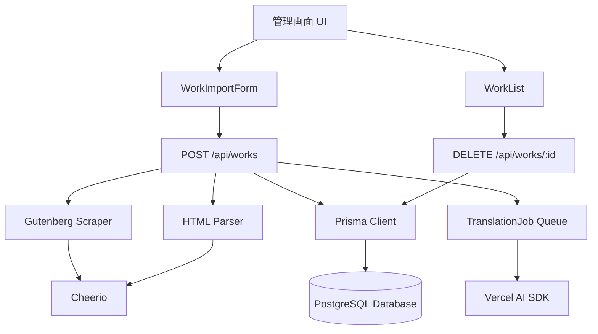

# 設計書：作品登録機能

## 概要

作品登録機能は、管理者がProject GutenbergなどのパブリックドメインサイトからURLを指定することで、英語小説を自動的にスクレイピング・パースし、データベースに構造化された形式で保存する機能です。この機能はアプリケーション全体の基盤となり、読書機能、翻訳機能、AIチャット機能を支えます。

**主要コンポーネント:**
- スクレイパー（Project Gutenberg HTML解析）
- パーサー（章・段落の自動検出とID生成）
- データベーススキーマ（Work、Chapter、Paragraph、TranslationJob）
- APIエンドポイント（作品登録・削除）
- 管理画面UI（作品インポートフォーム、作品リスト）

## ステアリングドキュメントとの整合性

### 技術標準（tech.md）

現在、ステアリングドキュメントは存在しませんが、Claude.mdに記載された技術スタックに従います：

- **Next.js 15 App Router**: サーバーコンポーネントとクライアントコンポーネントの明確な分離
- **TypeScript**: 型安全性を保証し、APIとデータモデルのインターフェースを明確化
- **Vercel AI SDK**: 翻訳ジョブとの統合
- **データベースORM**: Prismaを採用（理由：Next.jsとの相性、型生成、マイグレーション管理）
- **スクレイピング**: Cheerioを採用（軽量、サーバーサイド専用、DOM操作が不要）

### プロジェクト構造（structure.md）

Claude.mdに記載されたディレクトリ構造に従います：

```
app/
  admin/page.tsx                 # 管理画面
  api/
    works/route.ts               # POST（作品登録）、GET（作品一覧）
    works/[id]/route.ts          # DELETE（作品削除）、GET（作品詳細）
lib/
  scraper/
    gutenberg.ts                 # Project Gutenbergスクレイパー
    parser.ts                    # HTML/テキストパーサー
  types/
    work.ts                      # 作品関連の型定義
components/
  admin/
    WorkImportForm.tsx           # 作品登録フォーム
    WorkList.tsx                 # 作品管理リスト
prisma/
  schema.prisma                  # データベーススキーマ
```

## コード再利用分析

### 既存コンポーネントの活用

現在のプロジェクトは初期段階のため、再利用可能な既存コンポーネントは限定的です：

- **既存のUI コンポーネント**:
  - `components/ui/*` (Radix/shadcn UI) - ボタン、フォーム、ダイアログなどの基本UIコンポーネント
  - `lib/utils.ts` の `cn()` 関数 - Tailwind CSSクラスの条件付き結合
- **Next.js 15 の機能**:
  - App Router のサーバーコンポーネント
  - Route Handlers（API Routes）
  - Server Actions（フォーム送信時に活用可能）
- **Vercel AI SDK**:
  - 将来的に翻訳ジョブとの統合に使用

### 新規作成が必要なコンポーネント

- スクレイパー/パーサー（`lib/scraper/*`）
- データベーススキーマとモデル（`prisma/schema.prisma`）
- 作品管理API（`app/api/works/*`）
- 管理画面UI（`app/admin/*`、`components/admin/*`）
- 型定義（`lib/types/work.ts`）

### 統合ポイント

- **データベース**: Prismaを使用した新規スキーマ作成（既存のデータベースはなし）
- **Vercel AI SDK**: 将来的に翻訳ジョブAPI（`POST /api/works/:id/translate`）で使用
- **管理画面**: 既存のUI コンポーネントを活用して構築

## アーキテクチャ

### モジュラー設計の原則

- **単一ファイル責任**: 各ファイルは1つの特定の関心事またはドメインを扱う
  - `lib/scraper/gutenberg.ts`: Project Gutenberg専用スクレイパー
  - `lib/scraper/parser.ts`: HTML/テキストのパース専用
  - `app/api/works/route.ts`: 作品一覧・登録API専用
  - `app/api/works/[id]/route.ts`: 作品削除API専用
- **コンポーネントの分離**: 大きなモノリシックファイルではなく、小さく焦点を絞ったコンポーネントを作成
  - `WorkImportForm.tsx`: 作品登録フォームのみ
  - `WorkList.tsx`: 作品リスト表示のみ
- **サービスレイヤーの分離**: データアクセス、ビジネスロジック、プレゼンテーションレイヤーを分離
  - データアクセス: Prisma Client（`prisma/client`）
  - ビジネスロジック: スクレイパー/パーサー（`lib/scraper/*`）
  - プレゼンテーション: React コンポーネント（`components/admin/*`）
- **ユーティリティのモジュール性**: 焦点を絞った単一目的のモジュールに分割
  - `lib/scraper/url-validator.ts`: URL検証専用
  - `lib/scraper/metadata-extractor.ts`: メタデータ抽出専用

### システムアーキテクチャ図



### データフロー

**作品登録フロー:**
1. 管理者がWorkImportFormにURLを入力
2. クライアントが `POST /api/works` にリクエスト送信
3. サーバーがURL検証（`url-validator.ts`）
4. Gutenberg Scraper（`gutenberg.ts`）がHTMLをフェッチ
5. HTML Parser（`parser.ts`）が章・段落を検出しID生成
6. Metadata Extractor（`metadata-extractor.ts`）がメタデータ抽出
7. Prisma ClientがWork、Chapter、Paragraphレコードを作成
8. TranslationJobレコードを作成し、翻訳ジョブをキューに追加
9. クライアントに成功レスポンスを返す

**作品削除フロー:**
1. 管理者がWorkListで削除ボタンをクリック
2. 確認ダイアログが表示される
3. クライアントが `DELETE /api/works/:id` にリクエスト送信
4. サーバーがトランザクションを開始
5. 進行中の翻訳ジョブがあればキャンセル
6. 関連データを連鎖削除（TranslationJob → ChatLog → ReadingProgress → Paragraph → Chapter → Work）
7. トランザクションをコミット
8. クライアントに成功レスポンスを返す

## コンポーネントとインターフェース

### 1. Gutenberg Scraper (`lib/scraper/gutenberg.ts`)

- **目的**: Project GutenbergのHTML形式URLからHTMLをフェッチし、基本的なメタデータを抽出
- **公開インターフェース**:
  ```typescript
  export async function scrapeGutenbergWork(url: string): Promise<ScrapedWork>
  ```
- **依存関係**:
  - `cheerio`: HTML解析
  - `lib/scraper/url-validator.ts`: URL検証
  - `lib/scraper/metadata-extractor.ts`: メタデータ抽出
- **再利用**: なし（新規作成）

**型定義:**
```typescript
export interface ScrapedWork {
  sourceUrl: string;
  sourceId: string;
  title: string;
  author: string;
  language: string;
  rawHtml: string;
  publicationYear?: number;
}
```

### 2. HTML Parser (`lib/scraper/parser.ts`)

- **目的**: HTMLから章・段落を検出し、構造化されたデータに変換
- **公開インターフェース**:
  ```typescript
  export function parseWorkStructure(
    html: string,
    workId: string
  ): Promise<ParsedWork>
  ```
- **依存関係**:
  - `cheerio`: HTML解析
  - `lib/scraper/id-generator.ts`: ID生成
- **再利用**: なし（新規作成）

**型定義:**
```typescript
export interface ParsedWork {
  chapters: ParsedChapter[];
  totalParagraphs: number;
}

export interface ParsedChapter {
  chapterNumber: number;
  title: string;
  order: number;
  paragraphs: ParsedParagraph[];
}

export interface ParsedParagraph {
  id: string; // "work-{workId}/chapter-{index}/paragraph-{index}"
  originalText: string;
  order: number;
}
```

### 3. URL Validator (`lib/scraper/url-validator.ts`)

- **目的**: URLの形式検証とSSRF対策
- **公開インターフェース**:
  ```typescript
  export function validateGutenbergUrl(url: string): ValidationResult
  ```
- **依存関係**: なし
- **再利用**: なし（新規作成）

**型定義:**
```typescript
export interface ValidationResult {
  isValid: boolean;
  error?: string;
  normalizedUrl?: string;
}
```

### 4. Metadata Extractor (`lib/scraper/metadata-extractor.ts`)

- **目的**: HTMLからメタデータ（タイトル、著者、言語）を抽出
- **公開インターフェース**:
  ```typescript
  export function extractMetadata($: CheerioAPI): WorkMetadata
  ```
- **依存関係**:
  - `cheerio`: HTML解析
- **再利用**: なし（新規作成）

**型定義:**
```typescript
export interface WorkMetadata {
  title: string;
  author: string;
  language: string;
  publicationYear?: number;
}
```

### 5. ID Generator (`lib/scraper/id-generator.ts`)

- **目的**: 章・段落のユニークID生成
- **公開インターフェース**:
  ```typescript
  export function generateParagraphId(
    workId: string,
    chapterIndex: number,
    paragraphIndex: number
  ): string
  ```
- **依存関係**: なし
- **再利用**: なし（新規作成）

### 6. Work Registration API (`app/api/works/route.ts`)

- **目的**: 作品の登録と一覧取得
- **公開インターフェース**:
  - `POST /api/works`: 作品登録
  - `GET /api/works`: 作品一覧取得（検索・絞込・並び替え）
- **依存関係**:
  - `lib/scraper/gutenberg.ts`: スクレイピング
  - `lib/scraper/parser.ts`: パース
  - `@prisma/client`: データベースアクセス
- **再利用**: Next.js 15 Route Handlers

**リクエスト/レスポンス:**
```typescript
// POST /api/works
export interface WorkRegistrationRequest {
  url: string;
  genre?: string[];
  difficulty?: 'easy' | 'normal' | 'hard';
}

export interface WorkRegistrationResponse {
  id: string;
  title: string;
  author: string;
  status: 'processing' | 'completed';
  translationJobId?: string;
}

// GET /api/works
export interface WorkListResponse {
  works: WorkSummary[];
  total: number;
  page: number;
  pageSize: number;
}
```

### 7. Work Deletion API (`app/api/works/[id]/route.ts`)

- **目的**: 作品の削除（関連データも連鎖削除）
- **公開インターフェース**:
  - `DELETE /api/works/:id`: 作品削除
  - `GET /api/works/:id`: 作品詳細取得
- **依存関係**:
  - `@prisma/client`: データベースアクセス
- **再利用**: Next.js 15 Route Handlers

**リクエスト/レスポンス:**
```typescript
// DELETE /api/works/:id
export interface WorkDeletionResponse {
  success: boolean;
  message: string;
  deletedWorkId: string;
}
```

### 8. WorkImportForm Component (`components/admin/WorkImportForm.tsx`)

- **目的**: 作品登録フォーム（URL入力、ジャンル・難易度選択）
- **公開インターフェース**:
  ```typescript
  export function WorkImportForm(): JSX.Element
  ```
- **依存関係**:
  - `components/ui/*`: shadcn UIコンポーネント
  - React Hook Form（推奨）: フォーム管理
  - Zod: バリデーション
- **再利用**: `components/ui/*` の既存UIコンポーネント

**Props:**
```typescript
export interface WorkImportFormProps {
  onSuccess?: (workId: string) => void;
  onError?: (error: string) => void;
}
```

### 9. WorkList Component (`components/admin/WorkList.tsx`)

- **目的**: 作品リスト表示と削除機能
- **公開インターフェース**:
  ```typescript
  export function WorkList(): JSX.Element
  ```
- **依存関係**:
  - `components/ui/*`: shadcn UIコンポーネント
  - `GET /api/works`: 作品一覧取得
  - `DELETE /api/works/:id`: 作品削除
- **再利用**: `components/ui/*` の既存UIコンポーネント

**Props:**
```typescript
export interface WorkListProps {
  initialWorks?: WorkSummary[];
}
```

## データモデル

### Prismaスキーマ

```prisma
// prisma/schema.prisma

generator client {
  provider = "prisma-client-js"
}

datasource db {
  provider = "postgresql"
  url      = env("DATABASE_URL")
}

// 作品
model Work {
  id                   String             @id @default(cuid())
  title                String
  author               String
  publicationYear      Int?
  isPublicDomain       Boolean            @default(true)
  language             String             @default("en")
  genre                String[]
  tags                 String[]
  wordCount            Int?
  difficulty           String?            // "easy" | "normal" | "hard"
  coverUrl             String?
  sourceUrl            String             @unique
  sourceId             String
  license              String?
  popularityScore      Float              @default(0)
  translationStatus    String             @default("pending") // "pending" | "in_progress" | "completed" | "failed"
  translationProgress  Int                @default(0) // 翻訳済み段落数
  createdAt            DateTime           @default(now())
  updatedAt            DateTime           @updatedAt

  chapters             Chapter[]
  translationJobs      TranslationJob[]
  readingProgresses    ReadingProgress[]

  @@index([translationStatus])
  @@index([language])
  @@index([difficulty])
}

// 章
model Chapter {
  id             String      @id @default(cuid())
  workId         String
  chapterNumber  Int
  title          String?
  order          Int
  createdAt      DateTime    @default(now())
  updatedAt      DateTime    @updatedAt

  work           Work        @relation(fields: [workId], references: [id], onDelete: Cascade)
  paragraphs     Paragraph[]

  @@unique([workId, chapterNumber])
  @@index([workId, order])
}

// 段落
model Paragraph {
  id                 String            @id // "work-{workId}/chapter-{index}/paragraph-{index}"
  chapterId          String
  originalText       String            @db.Text
  translationNormal  String?           @db.Text
  translationEasy    String?           @db.Text
  order              Int
  glossaryTags       String[]
  createdAt          DateTime          @default(now())
  updatedAt          DateTime          @updatedAt

  chapter            Chapter           @relation(fields: [chapterId], references: [id], onDelete: Cascade)
  readingProgresses  ReadingProgress[]

  @@index([chapterId, order])
}

// 用語辞書
model GlossaryTerm {
  id             String   @id @default(cuid())
  originalTerm   String   @unique
  translation    String
  difficulty     String?  // "easy" | "normal" | "hard"
  definition     String?  @db.Text
  synonyms       String[]
  easyAlternative String?
  createdAt      DateTime @default(now())
  updatedAt      DateTime @updatedAt

  @@index([originalTerm])
}

// ユーザープロフィール（将来的に認証機能追加時に使用）
model UserProfile {
  id               String            @id @default(cuid())
  email            String?           @unique
  displayName      String?
  fontSize         String?
  theme            String?
  defaultMode      String?           // "original" | "japanese" | "parallel"
  createdAt        DateTime          @default(now())
  updatedAt        DateTime          @updatedAt

  readingProgresses ReadingProgress[]
  chatLogs         ChatLog[]
}

// 読書進捗
model ReadingProgress {
  id           String      @id @default(cuid())
  userId       String
  workId       String
  paragraphId  String
  updatedAt    DateTime    @updatedAt

  user         UserProfile @relation(fields: [userId], references: [id], onDelete: Cascade)
  work         Work        @relation(fields: [workId], references: [id], onDelete: Cascade)
  paragraph    Paragraph   @relation(fields: [paragraphId], references: [id], onDelete: Cascade)

  @@unique([userId, workId])
  @@index([userId])
  @@index([workId])
}

// チャットログ
model ChatLog {
  id                String      @id @default(cuid())
  userId            String?
  question          String      @db.Text
  answer            String      @db.Text
  referencedParagraphIds String[]
  mode              String?     // "original" | "japanese" | "parallel"
  createdAt         DateTime    @default(now())

  user              UserProfile? @relation(fields: [userId], references: [id], onDelete: Cascade)

  @@index([userId])
  @@index([createdAt])
}

// 翻訳ジョブ
model TranslationJob {
  id              String    @id @default(cuid())
  workId          String
  status          String    @default("pending") // "pending" | "in_progress" | "completed" | "failed"
  translationType String    // "normal" | "easy" | "both"
  totalCount      Int       // 全段落数
  completedCount  Int       @default(0) // 処理済み段落数
  errorLog        String?   @db.Text
  startedAt       DateTime?
  completedAt     DateTime?
  createdAt       DateTime  @default(now())
  updatedAt       DateTime  @updatedAt

  work            Work      @relation(fields: [workId], references: [id], onDelete: Cascade)

  @@index([workId])
  @@index([status])
}
```

## エラーハンドリング

### エラーシナリオ

1. **無効なURL**
   - **ハンドリング**: `url-validator.ts`でURL形式とドメインを検証し、不正な場合は400エラーを返す
   - **ユーザーへの影響**: 「URLが無効です。Project GutenbergのHTML形式URLを入力してください。」と表示

2. **HTMLフェッチ失敗**
   - **ハンドリング**: `fetch()`のエラーをキャッチし、502エラーを返す。一時的なエラーの場合は3回までリトライ（指数バックオフ）
   - **ユーザーへの影響**: 「ページの取得に失敗しました。URLを確認するか、しばらくしてから再試行してください。」と表示

3. **HTMLパース失敗**
   - **ハンドリング**: `parser.ts`でパースエラーをキャッチし、422エラーを返す。詳細なエラーメッセージ（「タイトルが見つかりません」等）をログに記録
   - **ユーザーへの影響**: 「ページの解析に失敗しました。このURLは対応していない可能性があります。」と表示

4. **データベース書き込み失敗**
   - **ハンドリング**: Prismaのトランザクションでロールバック。エラーログを記録し、500エラーを返す
   - **ユーザーへの影響**: 「作品の登録に失敗しました。管理者に連絡してください。」と表示

5. **重複URL登録**
   - **ハンドリング**: データベースのユニーク制約エラーをキャッチし、409エラーを返す
   - **ユーザーへの影響**: 「この作品は既に登録されています。」と表示

6. **削除対象の作品が存在しない**
   - **ハンドリング**: Prismaの`findUnique()`で作品を検索し、存在しない場合は404エラーを返す
   - **ユーザーへの影響**: 「指定された作品が見つかりません。」と表示

7. **削除トランザクション失敗**
   - **ハンドリング**: Prismaのトランザクションでロールバック。部分削除を防ぐ。エラーログを記録し、500エラーを返す
   - **ユーザーへの影響**: 「作品の削除に失敗しました。管理者に連絡してください。」と表示

8. **SSRF攻撃（プライベートIPへのアクセス）**
   - **ハンドリング**: `url-validator.ts`でプライベートIPアドレス（127.0.0.1、192.168.x.x、10.x.x.x等）を検出し、403エラーを返す
   - **ユーザーへの影響**: 「このURLはアクセスできません。」と表示

9. **レート制限超過**
   - **ハンドリング**: ミドルウェアまたはAPI内でレート制限チェック。超過した場合は429エラーを返す
   - **ユーザーへの影響**: 「登録回数の制限を超えました。10分後に再試行してください。」と表示

## テスト戦略

### ユニットテスト

**テスト対象:**
- `lib/scraper/url-validator.ts`: URL検証ロジック
  - 有効なProject Gutenberg URL
  - 無効なドメイン
  - プライベートIPアドレス
  - 不正な形式のURL
- `lib/scraper/metadata-extractor.ts`: メタデータ抽出
  - 正常なHTML（タイトル、著者、言語が正しく抽出される）
  - タイトルがない場合
  - 著者がない場合
- `lib/scraper/id-generator.ts`: ID生成
  - 一意性の検証
  - 形式の検証（`work-{workId}/chapter-{index}/paragraph-{index}`）
- `lib/scraper/parser.ts`: 章・段落の検出
  - 正常なHTML（章と段落が正しく検出される）
  - 空の段落を除外
  - ナビゲーション要素を除外

**テストフレームワーク:** Jest + Testing Library

### 統合テスト

**テスト対象:**
- `POST /api/works`: 作品登録フロー
  - 正常なURL → データベースに正しくレコードが作成される
  - 無効なURL → 400エラー
  - 重複URL → 409エラー
  - フェッチ失敗 → 502エラー
  - パース失敗 → 422エラー
- `DELETE /api/works/:id`: 作品削除フロー
  - 正常な削除 → 関連データも連鎖削除される
  - 存在しない作品 → 404エラー
  - 削除失敗 → トランザクションがロールバックされる

**テストフレームワーク:** Jest + Supertest（APIテスト）、Prismaのテストデータベース

### エンドツーエンドテスト

**テスト対象:**
- 管理画面での作品登録シナリオ
  1. 管理画面にアクセス
  2. URLを入力
  3. ジャンルと難易度を選択
  4. 登録ボタンをクリック
  5. 成功メッセージが表示される
  6. 作品リストに新しい作品が表示される
- 管理画面での作品削除シナリオ
  1. 作品リストで削除ボタンをクリック
  2. 確認ダイアログが表示される
  3. 確認ボタンをクリック
  4. 成功メッセージが表示される
  5. 作品リストから削除される

**テストフレームワーク:** Playwright または Cypress
